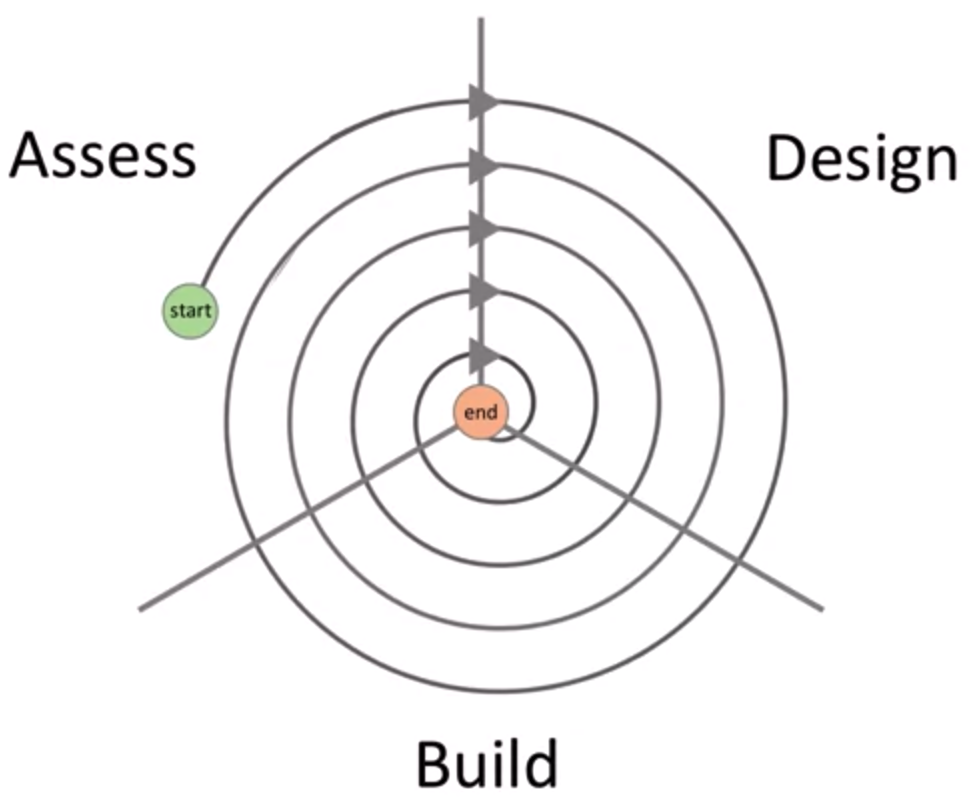

# What is UX
**UX** - the experience people have when they interact with your product
* Using the product
* Choosing
* Acquiring
* Learning to use
* Fixing the product
* Upgrading

# Good UX vs bad UX
| Good           | Bad            |
|:--------------:|:--------------:|
| Useful         | Stressful      |
| Helpful        | Confusing      |
| Easy to learn  | Ugly           |
| Accessible     | Distracting    |
| Attractive     | Inefficient    |
| Fun            | Tedious        |
| Connected      | Condescending  |
| Delightful     | Inconsiderate  |
| Satisfying     | Frustrating    |

slide why does it matter
	
Why UX is hard?
* You are not a user.
* Computers are weird.
* Software is usually complex.

# How to make UX easy
* Follow and iterative prototyping process
* Apply user-centered research and design methods
* Understand a bit about human behavior
* Apply common sense

# UX design process
UX design process model has two stages:
1. ASSESS
2. Design
3. Build

> You won't get it right from the first time.  
> You should get it wrong as quickly and as often a s possible, learn from mistakes, and then reduce wrongness.

**Conclusion:**  
UX design model in a form of a numbered stages will not handle continious fails and improvements, that why it has aa form of a spiral.

# UX design key methods.
* Developing Scenarios, personas, user stories.
* Sketching and ideations.
* Storyboarding.
* Mapping and navigation design.
* Comparative research.
* Lo-mid- and HI-fidelity prototyping.

# Components of UX
* Value
  *	Is it useful?
  *	Is it better than the alternatives?
* Usability
  *	Can users do what they need to do?
* Adoptability
  *	Is it easy to find and start using?
* Desirability
  *	Is it fun, attractive, and pleasant to use?