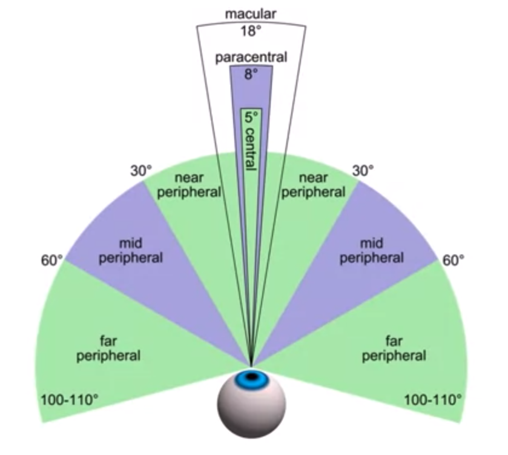

# Visual Perception
Homan field of vision is divided into sections.

peripheral on central vision differences

Information is obtained visually by sequenced eyes fixation (saccades). Basically user is jumping between points of interest. The same can be applied to reading.

### Design hints
* Make important info & actions visible.	
  * Don't hide it behind the complex menu structure or out of the standard viewport.
* Leverage the read.
  * Use profits of known patterns, such as F-pattern.
* When evaluating, ask yourself "did they see it?".
  * Didn't they see a link because they gave up before they get to it? Or because it was pretty poorly visible?

### Visual information recognition protocol
1. Features.
2. Shapes or groups of shapes.
3. Objects (at this stage patterns are interpreted as objects we recognize).

### Features
Analyzing visual information, primarily human eyes analyze set of primitive features:
* Colors.
* Shades.
* Angles.
* Slopes.
* Length.
* Regions with different texture.
* Motion.

> Features recognition is very fast (basically instant).  
> It supports subsequent stages (patterns and objects).  
> Allows "Pop-out" effect for attention attraction.  

**Pop-out effect** - the effect that simplifies objects recognition different from all other objects in simple visual features.

# Memory

### Memorizing process protocol
1. Sensory register.
1. Perception.
1. Short term memory.
1. Long term memory.

## Short term memory
* Limited capacity 7±2(original research), or even (according to latest research 4±1).
* Information that is not retained (committed to long term memory - basically, learning process) is lost.

### Design hints 
1. Keep a list of options short
2. Give users tools for reducing options
3. Don't expect the user to remember stuff (if the info from the prior screen is not visible, there is a high chance it will be lost, unless users have strong motivation to remember it).

## Long term memory
Contains everything we remember more then few seconds.
Information appears only by copying from the short term memory.

### Learning ways
* Association (new objects are associated with existing ones).
* Repetition (information is periodically repeated).

> Scchema - a set of associated objects in long-term memory.

### Likelihood of remembering
* Strength of association (how closely is it associated with the information user already have).
* Recency (how recently were they exposed the information).
* Frequency (how frequently they had to recall this info).

> Memories are often primed by stimuli that we receive

# Leveraging memorization
If there are no association objects, user has to remember information via repetition (which is much harder). So, it is in your best interest to leverage their associations. You can achieve that via:
* Metaphors. Applying real world metaphors to system component we can allow user intuitively understand component purpose and functional.
* Standards. Maintaining standards over the system (or even across the competitive products) It allow user who has learned to use one of these systems is picking up the other one will immediately know where to find certain types of operations, like a cut, copy, and paste, or save or rename, or those types of things.  
(e.g. MS Word && Google docs toolbar).
* Consistency.

### Design hints
* Prefer recognition over recall whenever possible.
* Use metaphors (like shopping cart).
* Maintain consistency.