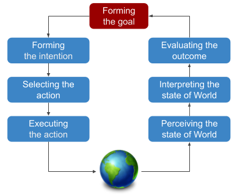

# Seven stages of action

This model is separated on two gulfs:
* Gulf of execution (1-4).
* Gulf of action (5-7).

# Bridging the gulfs
* Understand:
  *	Users goals.
  *	How they think about accomplishing them.
* Make sure likely actions are:
  * Visible.
  * Make sense.
* Make sure likely results of actions are:
  *	Visible
  *	Make sense

> Example:  
> * Glass doors. It's not obvious what door to push to get inside (actions are not visible).
> * Traffic light switch. You push the button, and if there is no light you will not receive feedback (results are not visible).

# Design Principles
For users to be able to effectively make use of a system that you've designed, they need to be able to discover what the system can do.  
Users need to be able to discover:
* What system can do.
* How to operate it.

### Supporting discoverability
* **Affordances** - feature of an object or an environment that indicates the possibility of action.
* **Signifiers** - feature of an environment or system that communicates through verbiage or imagery what will happen if an action is taken.
* **Feedback** - change in an environment or system that indicates that a user’s action was recognized and communicates the result of that action.
* **Constraints** 
* **Conceptual model** - how user understand system work.

# Hints
* Affordances of done well can communicate intuitively.
* Signifiers are often necessary when many actions are possible.
* Conventions and standards can reduce the need for affordances.
* Unavailable actions should be disabled. Limiting the total number of options will make the selection easier.
* User needs to know that the system has received its input and what it did with that input.
* Use consistency across all the places across the system, so the user will learn something in one place and will be able to use their knowledge in others.
* By constraining the actions that the user is able to take, we're able to keep them from taking an action that won't lead towards the result that they want, but encourages them to take the actions that are available.

## Conceptual models
It's important to support the formation of user's conceptual models so that as they interact with the system, they can learn not only how the specific actions work that they've already taken, but how future actions might work using that system. 

Conceptual models support simulation of future actions

> Appropriate use of affordances, signifiers, feedback, and constraints lead to the formation of accurate conceptual models 