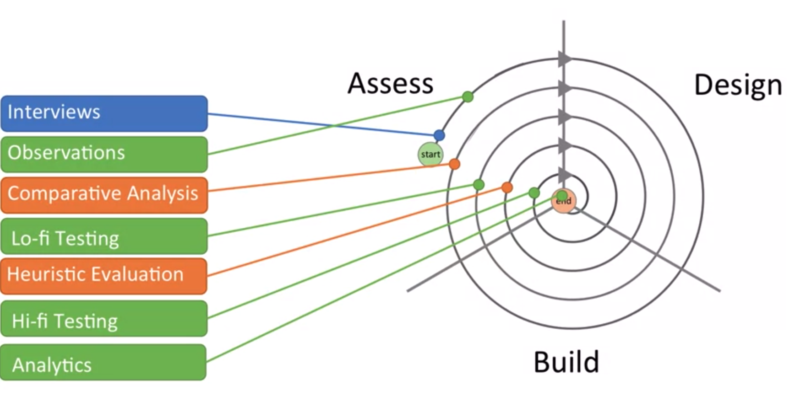

# Method groups
* **Ask** people what they do & think.
* **Observe** what users do.
* **Research** prototypes and sketches.

# Ask
* Interview - a conversation with the stakeholders to understand aspects of their experience.
* Survey - a set of questions distributed to lots of people to elicit attitudes, behaviors, and characteristics.
* Focus groups
* Diary studies
* Experience sampling

# Observe
* Ethnographic observation - watching people engage in activities to understand how they go about them.
* User testing - watching people perform scripted tasks to see if a system supports them.
* Usage analytics - analyzing large scale traces of system usage to understand patterns of use.
* Video analysis
* Social media mining

# Research
* Guideline-based - comparing system design against known best practices to find probable flaws.
* Walkthrough - stepping through an interaction sequence with a "user-eye" view to find probable breakdowns.
* Comparative analysis - systematically comparing design with similar designs to identify strengths and weaknesses.

# When to use?
Each technique should be used at its time.

### Ask when:
* Observation infeasible (infrequent, long, private).
* Values and motivations are key.
* Large numbers and hign certainty are needed (actual only for surveys).

### Observe when:
* Self-report will miss information (memory, tacit knowledge).
* Process and communications are important.
* Large numbers and hign certainty are needed (actual only for analytics).

### Observe when:
* You have a product to inspect
* Interacting with users is too expensive or cumbersome

